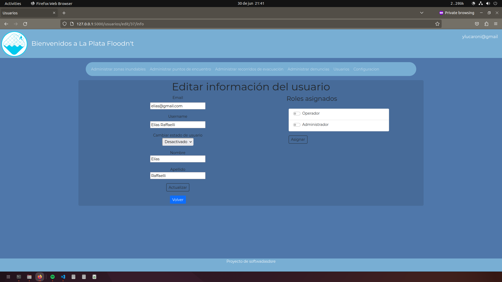

<a name="readme-top"></a>

<!-- PROJECT LOGO -->
<br />
<div align="center">
    

  <h3 align="center">La Plata Floodn't</h3>

  <p align="center">
    ¡Una app marcar zonas inundadas!
    
  </p>
</div>

<!-- TABLE OF CONTENTS -->
<details>
  <summary>Tabla de contenidos</summary>
  <ol>
    <li>
      <a href="#sobre-este-proyecto">Sobre este proyecto</a>
      <ul>
        <li><a href="#construido-con">Construido con</a></li>
      </ul>
    </li>
    <li>
      <a href="#como-levantar-la-app">Como levantar la App</a>
      <ul>
        <li><a href="#prerequisitos">Prerequisitos</a></li>
        <li><a href="#instalación">Instalación</a></li>
      </ul>
    </li>
    <li><a href="#qué-aprendí">Qué aprendí</a></li>
    <li><a href="#ejemplos">Ejemplos</a></li>
  </ol>
</details>

## Sobre este proyecto
Projecto de software final de la carrera APU. 

Una App para poder cargar y mostrar zonas inundadas de La Plata con el fin de poder advertir a los usuarios qué zonas evitar.
Separada en una App pública y una privada. <br />
En la App privada los usuarios Moderadores tienen los permisos necesarios para poder ver/cargar/editar/borrar zonas, puntos de encuentro, recorridos de evacuación y denuncias. Las zonas pueden ser cargadas manualmente o importadas desde un archivo CSV. <br />
Los usuarios Administradores tienen todos los permisos de los moderadores y ademas pueden editar usuarios, pudiendo cambiarles el rol o su estado, y cambiar la configuracion tanto de la App privada como de la pública. <br />
En la App pública cualquier persona puede entrar y realizar una denuncia sobre alguna zona de riesgo y ademas ver cuales son las zonas inundadas, los puntos de encuentro, los recorridos de evacuacuión. 

<p align="right">(<a href="#readme-top">Volver al inicio</a>)</p>

### Construido con
* Flask para el Back-End
* Utiliza SqlAlchemy para poder comunicarse con la base de datos
* Jinja2 para el Front-End de la app privada (utilizada por administradores y moderadores)
* Leaflet para dibujar y mostrar las zonas inundadas en los mapas
* Flask-Session para el manejo de sesiones
* Authlib para registrarse e iniciar sesión con una cuenta de google
* VUE para el Front-End de la app pública

<p align="right">(<a href="#readme-top">Volver al inicio</a>)</p>

## Como levantar la App
Qué pasos seguir para poder correr la App en tu pc.
### Prerequisitos
Cargar el archivo db/dump.sql en su base de datos local. Es importante cargar este archivo ya que si no se tienen los permisos cargados no podrás acceder a ningún menú de la la App.
Desde la command line de MySql sería así:
* MySql
  ```sh
  mysql -h "localhost" -u "root" -p "grupo5" < db/dump.sql
  ```
### Instalación
Recomendable utilizar un entorno virtual. 
* Crear un entorno virtual dentro del proyecto:
  ```sh
  virtualenv entornoVirtual
  ```
* Activar nuestro entorno virtual:
  ```sh
  source entornoVirtual/bin/activate
  ```
* Una vez dentro del entorno virtual instalar los paquetes de la App:
  ```sh
  pip install -r requirements.txt
  ```
* Ejecutar la App
  ```sh
  flask run
  ```
  Una vez levantada la app pueden iniciar sesión como administrador con el usuario "admin@gmail.com" y la pass "1234" o como usuario moderador con "mod@gmail.com" y "1234"
  
<p align="right">(<a href="#readme-top">Volver al inicio</a>)</p>
  
## Qué aprendí
Con este projecto aprendí a programar siguiendo el patrón de diseñp MVC. A autenticar usuarios, hashear sus contraseñas y registrarse usando una cuenta de Google. El uso de APIs para conectar el backend con el frontend. Y metodologias agiles de desarrollo. 

<p align="right">(<a href="#readme-top">Volver al inicio</a>)</p>

## Ejemplos
Algunas capturas de ejemplo para ver cómo es la App
* Editar información de usuario
  <div align="center">
    
  </div>
* Listado de zonas inundables
  <div align="center">
    
  </div>
* Detalle de zona
  <div align="center">
    
  </div>

  <p align="right">(<a href="#readme-top">Volver al inicio</a>)</p>
